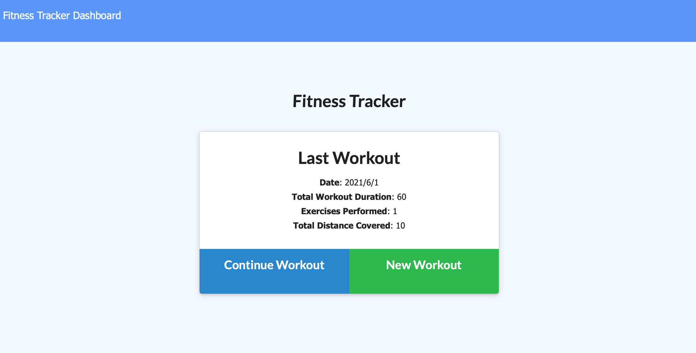
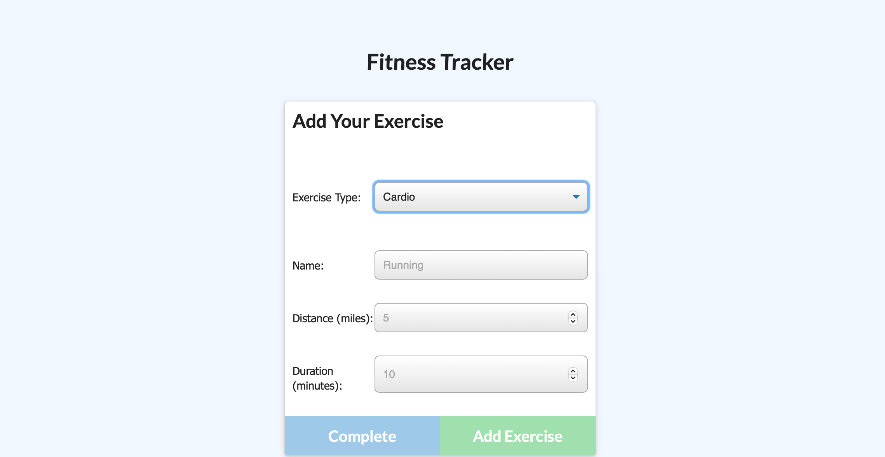
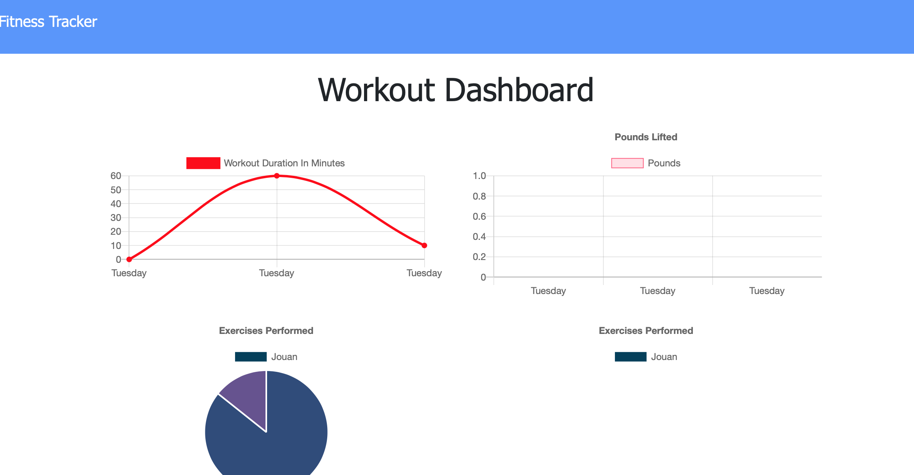

   

# 17. NoSQL Homework: Workout Tracker

## Description
We had been learning how to use node and Mongo DB to connect database and server. I learn how to structure connection between database and grab the information from Mongo database and the proper way of setting up the MongoDB Schemas. It was challenge to get the information structure out in the models and associated with each other front and back and using route for specific detail into Mongo DB. Over all I enjoy the process of seeing database being edit, add by GET, POST and PUT methods. 

## Installation:

Clone the repository to your local development environment.

```
git clone git@github.com:anniechen9025/Workout-Tracker.git
```

Run `npm install` in your terminal to install all dependencies. To run the application locally, run `node server.js` in your CLI, and then open `http://localhost:3000` in your preferred browswer. The Workout-Tracker app is [live on Heroku](https://jouan-workout-tracker.herokuapp.com) for you to use as well.


## Deployed Link:
[Tech Blog](https://jouan-workout-tracker.herokuapp.com)

[](https://jouan-workout-tracker.herokuapp.com)

## Example:




## Built With:
- [HTML5](https://html.com/html5/)
- [CSS](https://www.w3.org/Style/CSS/)
- [Javascript](https://www.javascript.com/)
- [Node.js](https://nodejs.org/en/)
- [Express.js](https://expressjs.com/)
- [Morgan](https://www.npmjs.com/package/morgan)
- [Mongoose](https://www.npmjs.com/package/mongoose)


## License
MIT 

## Badges


## Questions
        Please feel free to contact: 
        Github:https://github.com/anniechen9025/
        Email:anniechen9025@gmail.com
